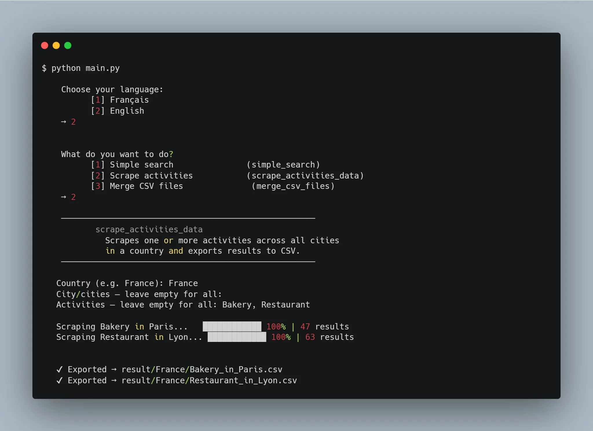

# GoogleMapsScrape

> **Disclaimer**
> This project was built as a personal exercise to practice Python, web scraping, and browser automation. I do not guarantee that scraping Google Maps complies with their Terms of Service. Use this tool responsibly, at your own risk, and do not abuse it. Respect rate limits and the data you collect. If you use it commercially, make sure you have the legal right to do so.

A Google Maps scraper that extracts business information (name, rating, reviews, phone, website, address) and exports it to CSV.

This started as a side project to test my Python skills and ended up being genuinely useful.



## Features

- **Simple search** -- one keyword in one city (e.g. "Bakery" in Cotonou)
- **Bulk scrape** -- predefined activities across all cities in a country
- **CSV merge** -- consolidate all results into a single file
- **Bilingual CLI** -- French / English with interactive prompts
- **Smart detection** -- handles single business pages, geographic regions, and cross-country redirects
- **Error logging** -- clean terminal output, detailed logs in `logs/`

## Quick start

**Prerequisites**: Python 3.8+, Google Chrome installed.

```bash
# 1. Clone
git clone https://github.com/roslove44/GoogleMapsScrape.git
cd GoogleMapsScrape

# 2. Virtual env (recommended)
python -m venv env
source env/bin/activate  # Linux/Mac
env\Scripts\activate     # Windows

# 3. Dependencies
pip install -r requirements.txt

# 4. ChromeDriver
# Download the version matching your Chrome:
# https://googlechromelabs.github.io/chrome-for-testing/
# Place chromedriver(.exe) at the project root, next to main.py

# 5. Run
python main.py
```

## Preconfigured countries

France (36k+ cities), Benin, Ivory Coast, Martinique. Custom cities can be entered manually.

Configuration in `assets/`: `france.json` (city list), `activities.csv` (370+ business types).

## Output

Results are exported as CSV files in `result/<country>/`. Use the merge option to consolidate them into `result/<country>/merge/`.

Error logs are written to `logs/` (one file per day).

## Good to know

Google Maps caps results at ~120 per search. For better coverage, split searches by neighborhood rather than searching an entire city.

## Stack

Python 3 | Selenium 4 | BeautifulSoup | InquirerPy | tqdm | tldextract

## License

MIT
